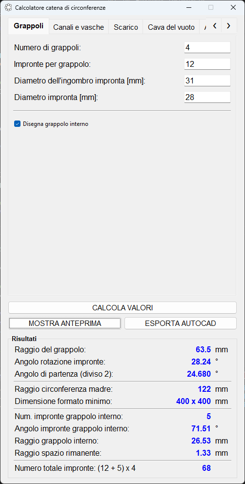
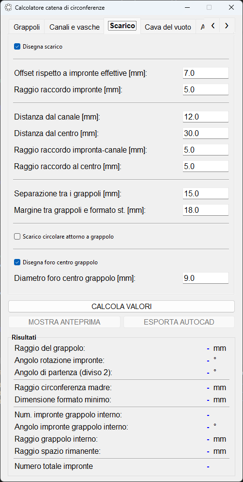
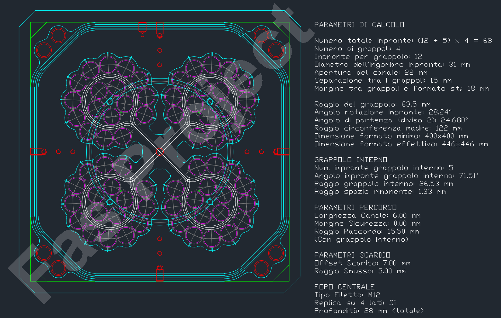

# Automazione Industriale: Calcolatore Parametrico per Pre-processamento CNC

### Panoramica del Progetto
Questo software è stato progettato per automatizzare il pre-processamento geometrico in un'officina meccanica specializzata in componenti automotive. L'obiettivo principale è la riduzione del tempo di setup per le macchine CNC, trasformando parametri tecnici complessi in disegni CAD (DXF) pronti per l'uso.

Nato da un'esigenza reale di ottimizzazione produttiva, il progetto dimostra l'applicazione di competenze di **Ingegneria Informatica** in un contesto industriale: dal calcolo geometrico avanzato allo sviluppo di interfacce utente funzionali.

### Caratteristiche Principali
- **Configurazione Parametrica**: Gestione dinamica di "grappoli" (cluster) di impronte con calcolo automatico dei raggi di rotazione e ingombri.
- **Automazione Percorsi Utensile**: Generazione automatica di canali di scarico e aspirazione aria, ottimizzati per la fresatura CNC.
- **Integrazione Meccanica**: Posizionamento intelligente di fori di fissaggio, spinature di centraggio e cave per il vuoto, basato su vincoli strutturali.
- **Esportazione CAD Intelligente**: Generazione di file DXF organizzati per layer, facilitando l'importazione diretta in sistemi CAM (come Delcam, Mastercam, etc.).

### Stack Tecnologico
- **Linguaggio**: Python 3.x
- **Interfaccia Grafica**: Tkinter (interfaccia intuitiva e centralizzata per l'inserimento dati).
- **Calcolo Geometrico**: NumPy (per la gestione di vettori, rotazioni e trigonometria avanzata).
- **Gestione DXF**: `ezdxf` (manipolazione programmatica di entità CAD).

### Visualizzazione (Mockup)
> **Nota**: Il codice sorgente non è disponibile pubblicamente per motivi di proprietà intellettuale e valore commerciale. Di seguito sono riportati gli screenshot dell'applicativo e dei risultati ottenuti.

#### Interfaccia Utente (UI)

  
  

#### Esempio di Risultato CAD (DXF)

---

### Nota per il Reclutatore / Project Manager
Questo progetto evidenzia la capacità di:
1. **Analizzare i requisiti**: Tradurre le necessità tecniche di un operatore di officina in logica software.
2. **Gestire il ciclo di vita**: Dalla raccolta parametri alla validazione geometrica fino all'output finale.
3. **Problem Solving**: Risolvere sfide matematiche e geometriche per garantire la fattibilità meccanica dei disegni.

---
© 2026 - Davide Falconi
